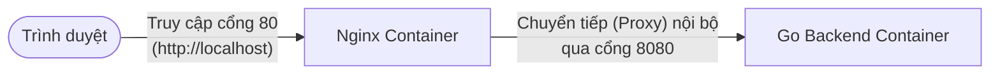

# Tài liệu giải thích cấu hình Nginx

Tài liệu này giải thích chi tiết cơ chế hoạt động của file cấu hình Nginx (`localhost.conf`) trong hệ thống, giúp bạn dễ dàng ôn tập và tự thiết lập lại kiến trúc sau này.

## 1. Bức tranh toàn cảnh: Kiến trúc Reverse Proxy

Trong hệ thống của chúng ta, Nginx đóng vai trò là một **Reverse Proxy** (Máy chủ proxy ngược). Hãy tưởng tượng Nginx giống như một cô tiếp tân đứng ở cửa chính của công ty.



* **Khách hàng (Client):** Chỉ biết đến Nginx (đứng ở cổng 80). Họ không hề biết bên trong hệ thống đang chạy ngôn ngữ Go hay hệ thống nào khác.
* **Nginx (Cô tiếp tân):** Nhận yêu cầu từ người dùng, xem xét yêu cầu đó, rồi "âm thầm" chuyển tiếp nhờ `go-backend` xử lý. Khi `go-backend` đưa kết quả, Nginx mang kết quả đó trả lại cho người dùng.

**Lợi ích của mô hình này:** 
Giúp dễ dàng mở rộng hệ thống (gộp nhiều backend/frontend lại với nhau), cấu hình HTTPS (chứng chỉ bảo mật SSL), chống DDoS, hoặc chặn IP xấu trực tiếp trên Nginx mà không cần phải đụng chạm vào mã nguồn của backend Go.

---

## 2. Bức tranh cục bộ: Nginx phân loại yêu cầu ra sao?

Khi luồng dữ liệu đi vào Nginx, Nginx dùng 2 khối (block) chính để phân loại kịch bản xử lý:

* **Khối `server { ... }`**: Tương đương với một "Cửa hàng" (Virtual Host). Bạn có thể mở nhiều cửa hàng độc lập trên cùng một máy chủ Nginx (VD: 1 cửa hàng cho `localhost`, 1 cửa hàng cho tên miền thật `chuongtran.com`).
* **Khối `location { ... }`**: Tương đương với các "Quầy hàng" bên trong cửa hàng đó. Nó dùng để rẽ nhánh xử lý dựa vào đường dẫn URL (VD: quầy chuyên xử lý `/docs`, quầy chuyên xử lý `/images`).

---

## 3. Chi tiết từng dòng code trong `localhost.conf`

Dưới đây là phần giải thích chi tiết từng dòng trong file cấu hình hiện tại của dự án:

```nginx
server { 
    # Mở một "Cửa hàng" mới để phục vụ khách.
    
    listen 80; 
    # Mở cửa ở Cổng 80. 
    # (Cổng 80 là cổng mặc định của giao thức HTTP. Khi bạn gõ "http://localhost", trình duyệt tự động ngầm hiểu là gọi vào cổng 80).
    
    server_name localhost; 
    # Tên của cửa hàng này là "localhost". 
    # Nginx dựa vào dòng này để biết khách đang truy cập bằng tên miền nào. Ở đây nó chỉ tiếp đón khách gõ đúng chữ "localhost".

    location / { 
        # Khách đi vào "Quầy" mặc định. (Dấu "/" đại diện cho MỌI đường dẫn).
        # Bất kể khách gọi trang chủ (/), hay /docs, hay /api/user... tất cả đều lọt vào quầy này.
        
        proxy_pass http://go-backend:8080; 
        # Hành động của quầy này là: "Nhờ người khác làm hộ" (Reverse Proxy).
        # Nginx bê nguyên xi yêu cầu của khách ném sang địa chỉ "http://go-backend:8080".
        # ĐIỂM QUAN TRỌNG: "go-backend" chính là tên container Go trong file docker-compose. Mạng nội bộ của Docker cực kỳ thông minh, nó tự động phân giải tên này thành IP nội bộ, sau đó đập cửa cổng 8080 để đẩy dữ liệu vào cho code Go xử lý.
    }
}
```

**Tóm tắt logic hoạt động:**
> *"Nếu có ai truy cập vào cổng **80** với tên miền là **localhost**, bất kể họ đi vào đường dẫn nào (**/**), Nginx sẽ lập tức mang yêu cầu đó chuyển sang cho máy chủ **go-backend** ở cổng **8080** xử lý, đợi backend làm xong rồi lấy kết quả trả về cho trình duyệt của khách."*
